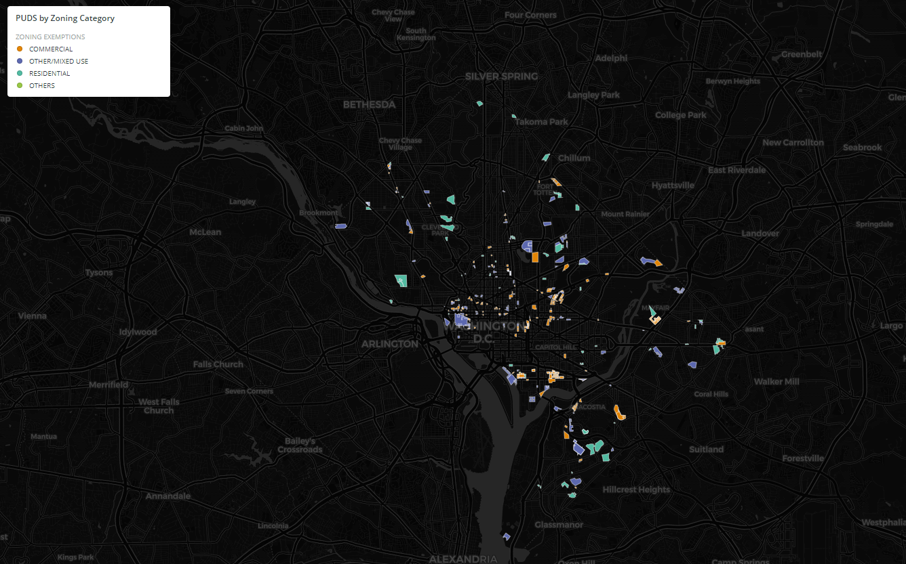

# Introduction & Objective
Many cities across the country are experiecing a critical housing crisis where the cost of housing is outpacing living wages. An important product of that issue is how eviction is handled. Identifying how Zoning is implemented in a city is a proxy to examin evicitions. The purpose of this lab is to investigate how Washington D.C has spatially managed the situation by utilizing Planned Unit Developments (PUDs), which are used to reduce the harm of gentrification by exchanging zoning examptions. The fata was sourced from [OpenData D.C.](https://opendata.dc.gov/) 

Furthermore, this objective of this lab was to further skills in using Python within Google Colab, while also introducing workflows in Pandas, GeoPandas, and CARTO. Pandas and GeoPandas are important Python tools because they enable users to examine, modify, and model relationships among tabular and geospatial data, respectively. CARTO is a also a useful tool for geospatial professionals because it is multifunctional platform that handles various types of data, which it can further visualize. Additionally, user-generated CARTO products can be published for public accessibility. 

The analysis performed in this lab was smooth, however, when I perform data analysis and geospatial operations, I typically use R. Using Pandas and GeoPandas was exciting to expereiment with. Although these packages are more 'program style language' in comparison to R, which has very simple and understandable naming conventions, I found them to be useful and easy to learn. It just took a quick refresher visiting sites with tutorials, such as [this.](https://geopandas.org/getting_started/introduction.html) I found that using CARTO was a bit overwhelming at first, but was easy to find information on. However, I would prefer using MapBox if I had the choice. 

Observe [my final map here](https://maxenger.carto.com/builder/19791875-55ba-45bc-b629-7468d5ba1d5a/embed?state=%7B%22map%22%3A%7B%22ne%22%3A%5B38.78165483591878%2C-77.28332519531251%5D%2C%22sw%22%3A%5B39.027718840211605%2C-76.64886474609376%5D%2C%22center%22%3A%5B38.90479344272695%2C-76.96609497070314%5D%2C%22zoom%22%3A12%7D%7D).  

# Tutorial Citation
This tutorial was originally created by [Nicole Janeway Bills](https://twitter.com/nicole_janeway), who provides a nice [video walkthrough on YouTube here](https://www.youtube.com/watch?v=b9G2T4CPYVM&feature=emb_logo). I've changed some of the code slightly to deal with different inputs (Open Data D.C.'s file formatting has changed since the original tutorial); added more background context on the scenario, and added the use of Carto for a final output.
